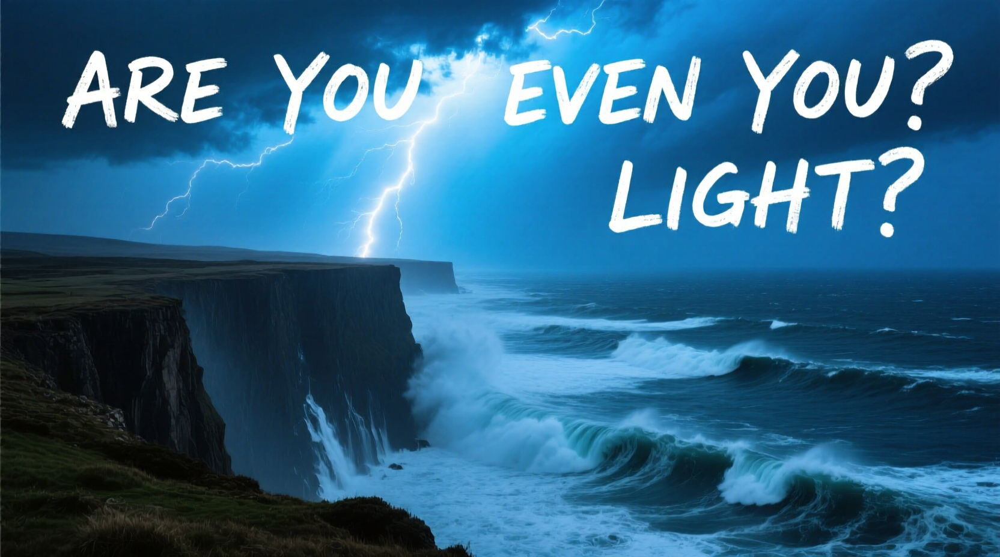

# c0nsume Qwen



### SET UP YOUR `venv`:
Create a python virtual environment (tested on 3.12 but I imagine 3.9 and forward all work fine):
```
git clone https://github.com/E10H1M/c0nsume-qwen.git
cd c0nsume-qwen
python3 -m venv venv
. ./venv/bin/activate
```

### SETUP FOR `pytorch`:

For pytorch 12.8 Linux (what i tested):
```
pip3 install torch torchvision
```

For other versions:
```
1. go to: https://pytorch.org/
2. scroll down
3. select the version you want. 
4. for older versions, go to: https://pytorch.org/get-started/previous-versions/
```


### INSTALL PROJECT `REQUIREMENTS`:
After installing torch, install project requirements via:
```
pip install -r god.txt 
```

To download the weights for the project, refer to `download_instructions.txt`.<br>
Automation for downloads will be added soon, some time tomorrow or the following day. <br>
(Aug 20th or 21st).


### RUN NOTEBOOKS:
To open up jupyterlab:
```
jupyter lab
```

For bitsandbytes (need ~16 GB of VRAM), use `qwen_bnb.ipynb` <br>
For torchtao  (need 24GB VRAM GPU), use `qwen_torchao.ipynb`

-------------------
This repo is susceptible to active changes. Especially the Readme as more model architectures are included. Qwen-Image-Edit will be added next.
<br>
<br>
<br>
<br>


<div align="center">
Rest in peace Terry Davis. 
</div>
<div align="center">
  
</div>

<div align="center">
  
</div>
<div align="center">
Thank you for TempleOS. But even more so: for being a light.
</div>
